# Jellyfish-with-Rust

<i> "Rust is technology from the past came to save the future from itself." </i>

## Note:

- Cargo is the Rust package manager and build system. Cargo is part of the standard Rust toolset.

```bash

# Create package
cargo new <pack name>

# Build in debug mode
cargo build 

# Build in release mode
cargo build --release

cargo run

# Check infor
cargo check

```

- Keyword

```rust
pub enum Color { // pub => public, can import and use in an other file
    Red,
    Green,
    Blue
}


mod mytypes; // => load the module
use mytypes::Color; // => Intruduce the Color type into scope 

pub enum Color {
    #[allow(dead_code)] Red, // => attribute: allow Red not to be use
    #[allow(dead_code)] Green,
    #[allow(dead_code)] Blue
}

// Option Enums
enum Option<T> {
    Some(T),
    None
}

// Results Enums
enum Result<T, E> {
    Ok(T),
    Err(E)
}

fn sec_of_day(h: u32, m: u32, s: u32) -> Option<u32> { // => function with return type Option<u32>
    // some code here
}


// https://doc.rust-lang.org/book/ch07-01-packages-and-crates.html
use crate::mytypes::point::Point;

pub fn do_it() {

    println!("\nIn demo_modular_code::do_it()");

    let mut p1 = Point {x: 10, y: 20};

    p1.move_by(100, 200);
    println!("{}", p1.to_string());

    p1.reset();
    println!("{}", p1.to_string());
}

```

- <b> loop </b> : A keyword used for an infinite loop, which can be exited using a break statement.

- <b> while </b> : A conditional loop that continues as long as its condition is true.

- <b> for </b> : A loop that iterates through elements of a collection or range.

- <b> break </b> : A control flow keyword to exit the current innermost loop early.

- <b> mutability </b> : The ability for a variable to have its value changed during runtime by marking it as mutable with the mut keyword

- <b> option </b> : A Rust enum type that can be either Some(value) or None, used to represent optional values.

- <b> continue </b> : A control flow keyword to skip an iteration and move on to the next one in the same loop.

- <b> if let </b> : A pattern matching construct that allows you to conditionally bind variables based on their match against a given value or pattern.

- <b> sum </b> : An enum type wrapper around Option<T> which can be either Some(value) or None.

- <b> range </b> : Represents a sequence of numbers, often used in loops for iteration purposes.

- <b> shadowing </b> : A variable redeclaration with the same name but different value and/or scope within the same context.

- <b> Function </b> : A block of code designed to carry out a specified task. In Rust, it's a crucial part of the language as Rust is almost like a functional programming language.

- <b> Unit Function </b> : A function that doesn't return any value but does some work when called.

- <b> Return Value </b> : The result given by a function upon completion. It can be explicitly defined or implicitly returned as unit type in case of unit functions.

- <b> Borrowing </b> : Concept in Rust which ensures efficient memory usage by safely lending values to other parts of the code without taking ownership away from their original scopes.

- <b> Panic </b> : A special call syntax in Rust used to stop all execution in a program; it's not commonly used in production code but can be helpful during development or for certain error handling scenarios.

- <b> Control Flow </b> : The order in which code is executed based on conditions and loops. In Rust, control flow includes if, else, match, and looping constructs like for or while.

- <b> Enumerator (Enum) </b> : A data type representing a set of values where each value represents a distinct case. An example in the transcript is the Option<T> enum with cases Some(T) and None.

- <b> Move </b> : In Rust, move occurs when ownership of a variable is transferred from one scope to another without any borrowing mechanism being used. This results in the original variable becoming invalid.

- <b> Copy </b> : A special trait in Rust which allows values of certain types (e.g., integers and booleans) to be copied instead of moved or borrowed when assigned or passed as arguments.

- <b> Vector </b> : A dynamic array data structure provided by Rust's standard library, used for storing a variable number of elements efficiently. It can grow or shrink in size during runtime.

### Bench test

#### Map

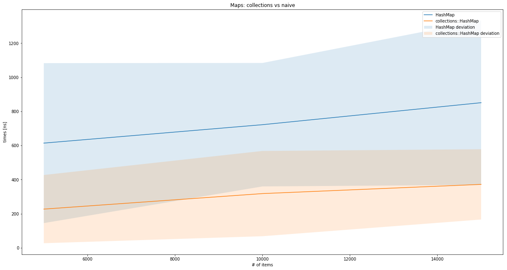

#### Sequence

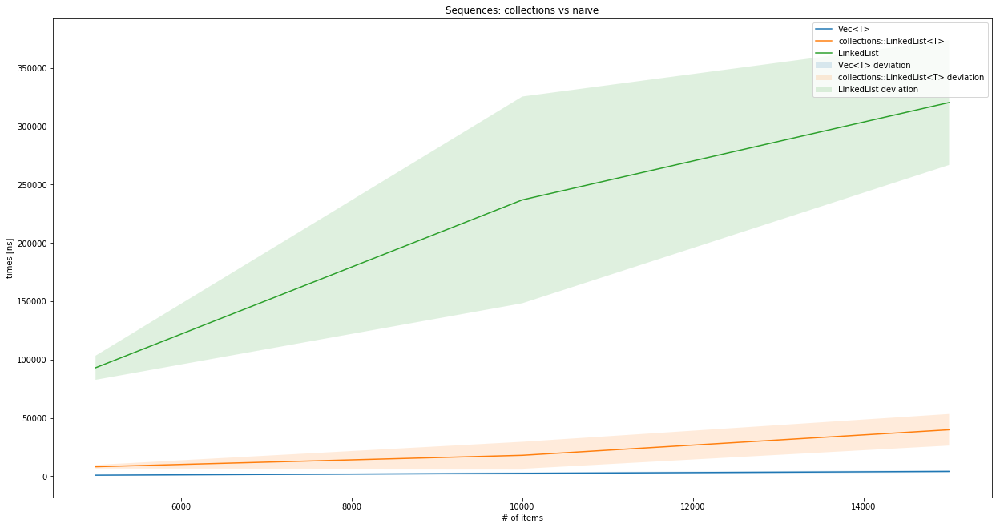

#### Tree

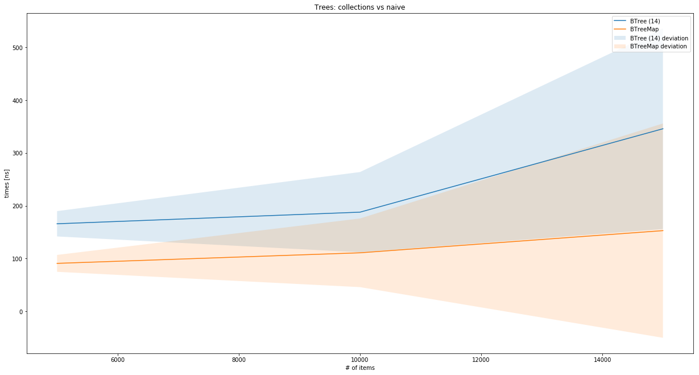

#### Bubble Sort

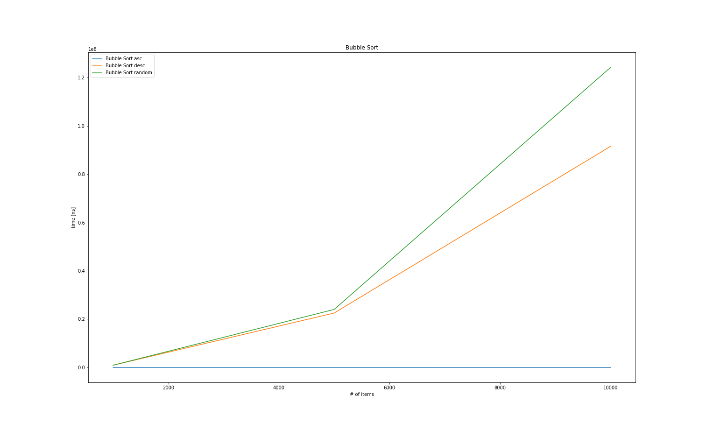

#### Heap Sort

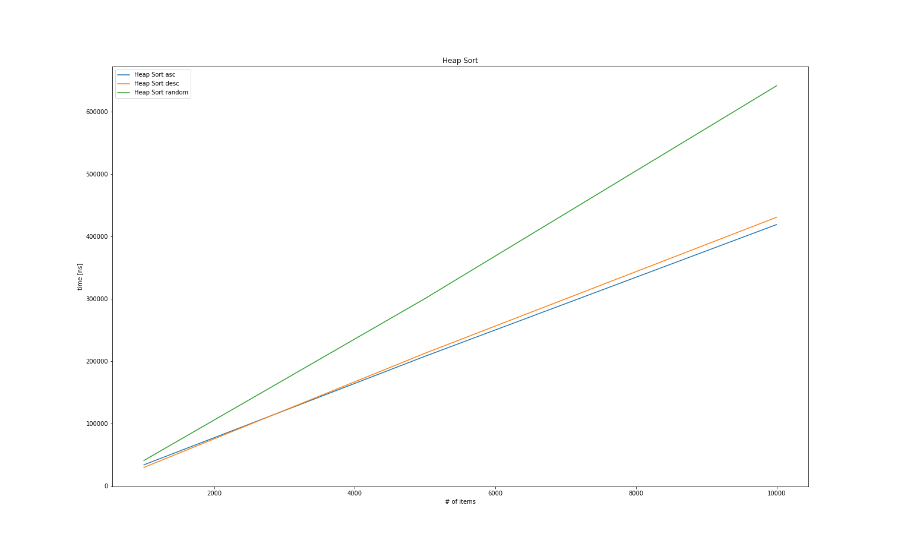

#### Merge Sort

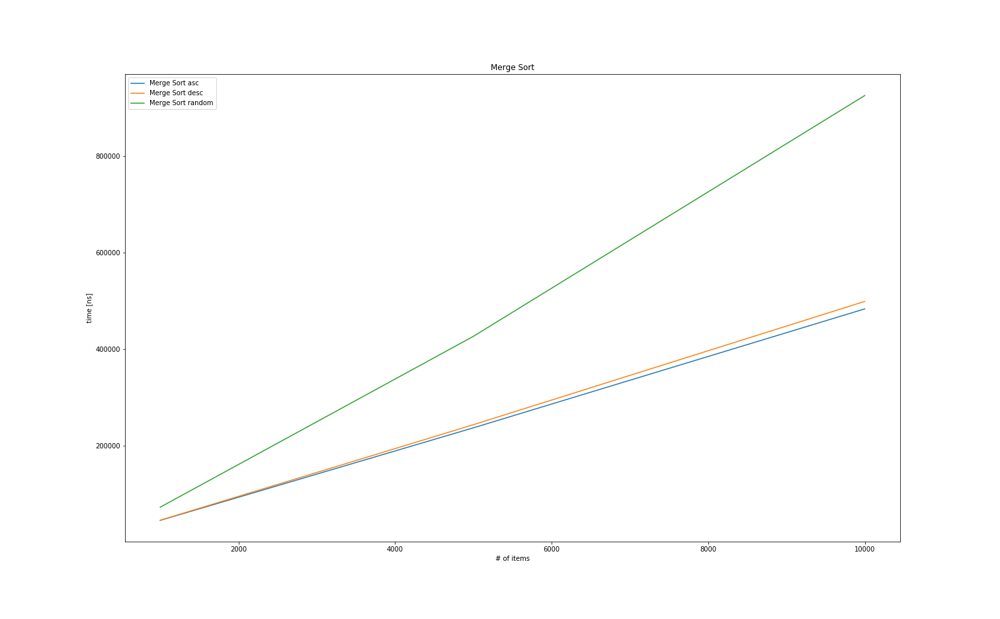

#### Quick Sort

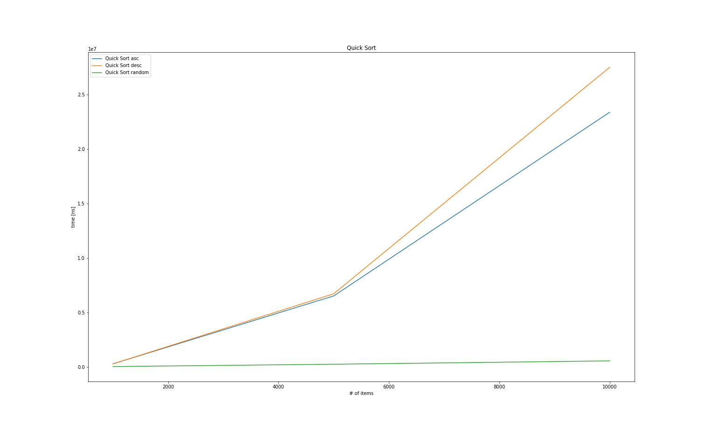

#### Shell Sort

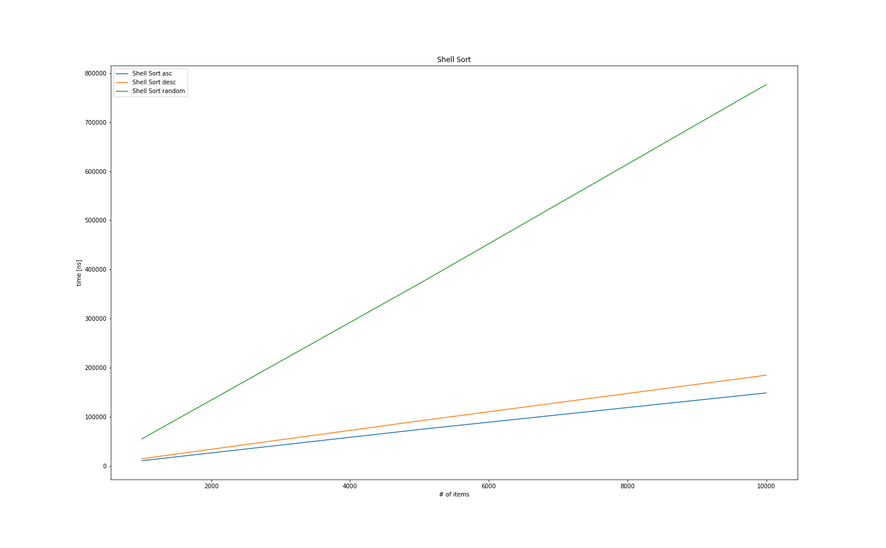

#### Stdlib Sort

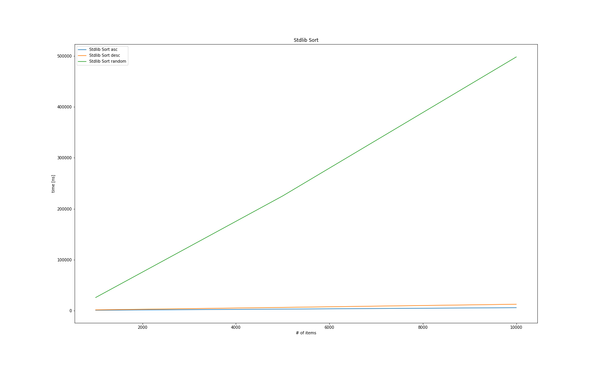

### Runtime

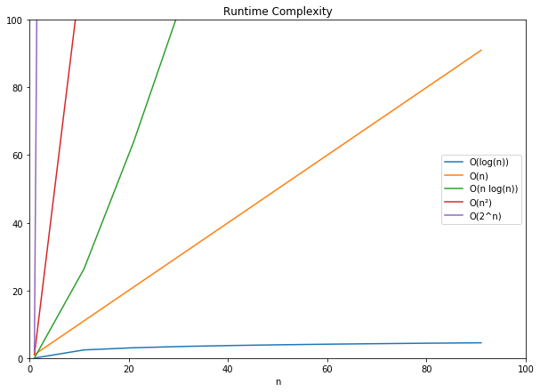

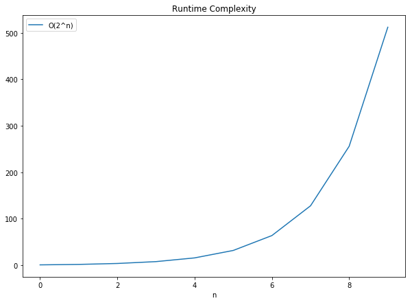

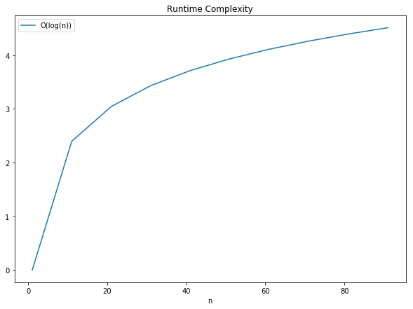

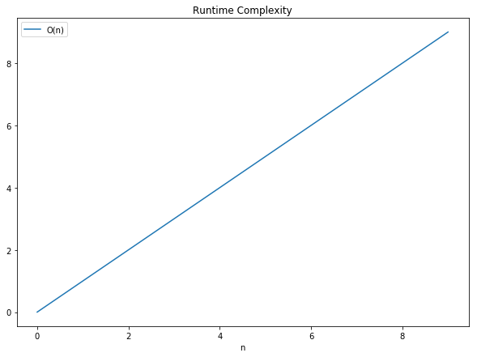

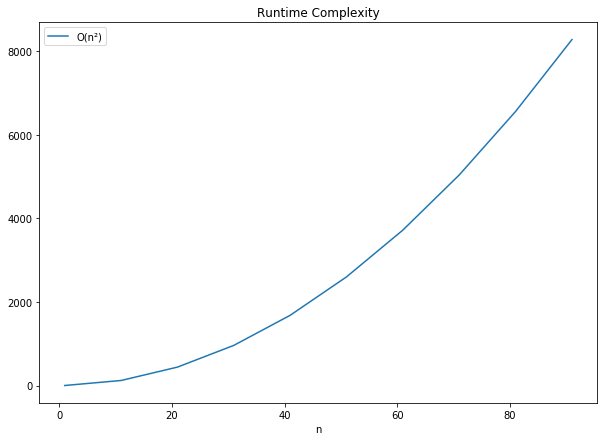

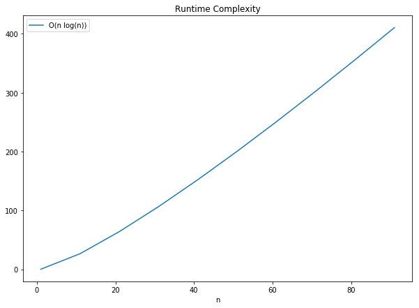


